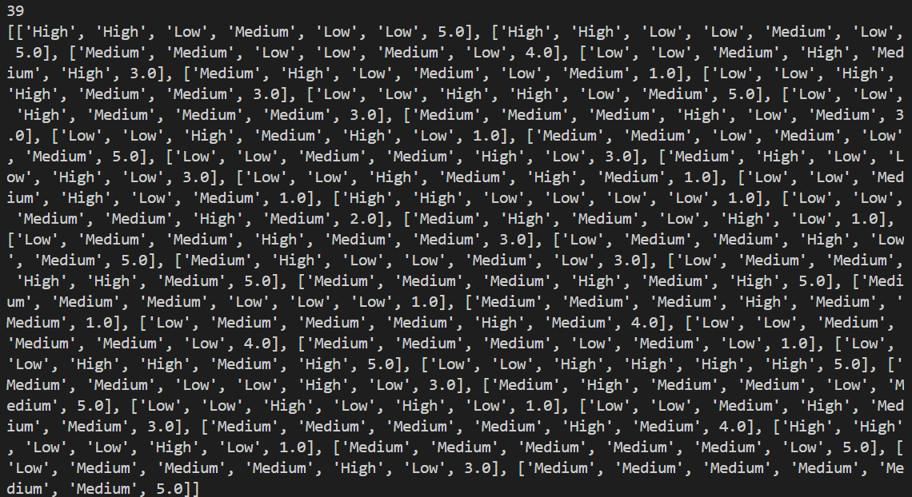

Đầu vào của thuật toán FKG :  
Test : 30% của bộ luật  

Train : 70% dữ liệu của bộ luật  

Thời gian hoàn thành FKG:  

Độ chính xác : 

Giá trị res: 

Số lượng bộ train:  

Số lượng bộ test: 

Count list rank and list rank: 

