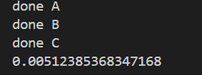
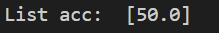
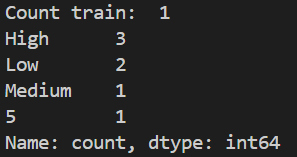
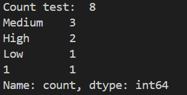
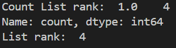

Đầu vào của thuật toán FKG với KmeansKmeans:  
Test : 30% của bộ luật  

Train : 70% dữ liệu của bộ luật  

Thời gian hoàn thành FKG: 

Độ chính xác : 

Giá trị res: 

Số lượng bộ train: 

Số lượng bộ test: 

Count list rank and list rank: 
