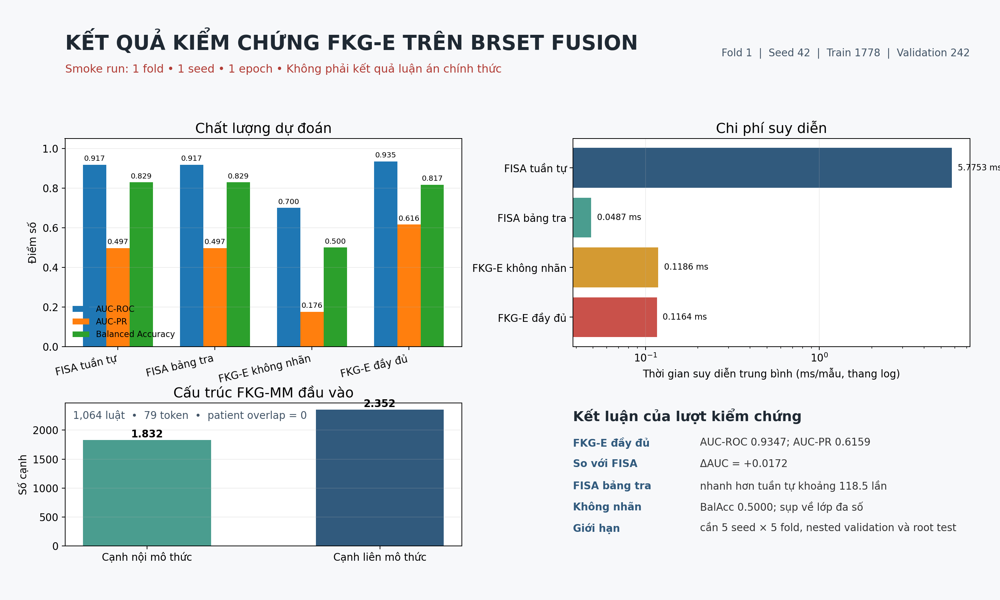

# BRSET fusion smoke result

> Diagnostic run only: one validation fold, one seed, and a small epoch budget.

- Source revision: `929246b79e368c59d14aa4f2731f7941150dfd79`
- Fold: `1`
- Epochs: `1`
- Seed: `42`
- Patient overlap: `0`
- Modalities: `image, table`
- Rules: `1064`
- Intra-modal edges: `1832`
- Cross-modal edges: `2352`
- Majority-class accuracy: `0.9174`

| Method | AUC-ROC | AUC-PR | F1 | BalAcc | Accuracy | ms/sample |
|---|---:|---:|---:|---:|---:|---:|
| FISA sequential | 0.9175 | 0.4969 | 0.3654 | 0.8286 | 0.7273 | 5.7753 |
| FISA lookup | 0.9175 | 0.4969 | 0.3654 | 0.8286 | 0.7273 | 0.0487 |
| FKG-E unsupervised | 0.6998 | 0.1758 | 0.0000 | 0.5000 | 0.9174 | 0.1186 |
| FKG-E full | 0.9347 | 0.6159 | 0.4000 | 0.8169 | 0.7893 | 0.1164 |

These values are pipeline verification evidence, not thesis results. The official protocol still requires five seeds, five folds, nested validation, the root test split, and the remaining objective terms/baselines.
