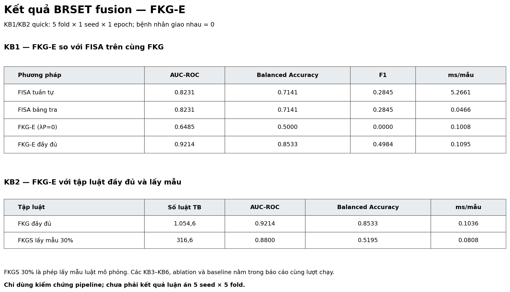

# Kết quả chạy kịch bản FKG-E trên BRSET fusion — 28/09/2026

## Phạm vi và trạng thái

- Lệnh: `python -u fkge_v2\run_all.py --quick --brset-only --epochs 1 --run-id tan_20260928_brset_fusion_quick`
- Trạng thái: `completed`, exit code 0, thời gian 48,6 phút.
- Dữ liệu: gói FRB BRSET fusion ảnh + bảng thật `Source_code/data/exports/frb_patient_id_20260923`; không dùng dữ liệu synthetic.
- KB1 và KB2: 5 fold, 1 seed, 1 epoch. KB3–KB6, ablation và baseline dùng lưới quick, một validation fold, 1 seed, 1 epoch.
- Đối chiếu trực tiếp `train.csv`/`val.csv`: cả 5 fold đều có `patient_group_overlap_count=0`.
- Đây là lượt kiểm chứng pipeline. Các số dưới đây không phải kết quả luận án theo giao thức 5 seed × 5 fold, validation lồng và outer test.

## KB1 — FKG-E và FISA trên cùng FKG

| Phương pháp | AUC-ROC | Balanced Accuracy | F1 | ms/mẫu |
|---|---:|---:|---:|---:|
| FISA tuần tự | 0,8231 | 0,7141 | 0,2845 | 5,2661 |
| FISA bảng tra | 0,8231 | 0,7141 | 0,2845 | 0,0466 |
| FKG-E bỏ `L_pred` | 0,6485 | 0,5000 | 0,0000 | 0,1008 |
| FKG-E đầy đủ | 0,9214 | 0,8533 | 0,4984 | 0,1095 |

Các số là trung bình 5 fold với một seed. FKG-E đầy đủ nhanh hơn FISA tuần tự nhưng chậm hơn FISA bảng tra ở lượt này.

## KB2 — Lấy mẫu luật 30%

| Cấu hình FKG-E đầy đủ | Số luật TB | AUC-ROC | Balanced Accuracy | ms/mẫu |
|---|---:|---:|---:|---:|
| FKG đầy đủ | 1.054,6 | 0,9214 | 0,8533 | 0,1036 |
| FKGS lấy mẫu 30% | 316,6 | 0,8800 | 0,5195 | 0,0808 |

Lấy mẫu 30% tăng tốc suy diễn khoảng 1,28 lần nhưng giảm AUC 0,0414 và giảm mạnh Balanced Accuracy. Đây là lấy mẫu luật mô phỏng trong `PrefuzzifiedRulePipeline`, chưa phải kết quả S-FKGS với `theta*` đã chọn ở Chương 2.

## Các kịch bản còn lại

| Kịch bản | Kết quả quick | Giới hạn chính |
|---|---|---|
| KB3 | `d=8`: AUC 0,9324; `d=32`: 0,9347; quy tắc chọn `d=8` | Chỉ quét 2/5 mức `d` |
| KB4 | Bỏ `lambda_P`: AUC 0,6998; mức mặc định 0,9347 | Chỉ 5 trọng số đã cài đặt, hai mức mỗi trọng số; thiếu random search |
| KB5 | AUC 0,9234 (`w=1`) và 0,9347 (`w=2`), biên độ 0,0113 | Chỉ 4/9 cặp `(w,K)` |
| KB6 | 426 luật: FKG-E 0,0860 ms/mẫu; 1.064 luật: 0,1047 | Chỉ 2/5 tỉ lệ luật nên hệ số góc chưa đáng tin |
| Ablation | Full AUC 0,9347; bỏ `L_pred` 0,6998; chỉ `L_pred` 0,9331 | 9 biến thể đã triển khai, chưa đủ ablation theo thiết kế |
| Baseline | MLP fuzzy AUC 0,9644; FKG-E đầy đủ 0,9347 trên một fold | Ngân sách huấn luyện chưa cân bằng; các bản nhúng `-lite` không phải baseline chuẩn |

## Những phần chưa thể xem là hoàn thành theo tài liệu

- Chưa có hai file dữ liệu thô thật `diabetes_kaggle_raw.json` và `healthcare_diabetes_raw.json`; KB1 chỉ chạy BRSET để không trộn synthetic.
- Chưa có đánh giá outer test với chọn tham số trên validation lồng và 5 seed × 5 fold. Không dùng lượt quick này để kiểm định không kém hơn, paired test hoặc khẳng định hiệu quả lâm sàng.
- `L_edge`, `L_A`, `L_B`, `L_rule` và attention pooling chưa được cài đặt trong model; các dòng ablation tương ứng chưa chạy.
- Node2Vec chuẩn, XGBoost và PyKEEN chưa được tích hợp vào runner. Các bản `DeepWalk-lite`, `TransE-lite`, `DistMult-lite` chỉ là đối chứng kiểm tra luồng.
- KB-M1–KB-M6 của FKG-MM là bộ thực nghiệm riêng, không được thực hiện bởi `fkge_v2/run_all.py`.
- Manifest ghi `source_revision` là commit HEAD. Lượt chạy này còn dùng các thay đổi chưa commit để thêm `--brset-only` và `--epochs`; bản vá chính xác được lưu ở `source_changes.patch` cùng thư mục.

## File kết quả

- `result_summary.png`: ảnh bảng KB1 và KB2 để xem hoặc gửi nhanh.
- `report_tong_hop.md`: bảng tổng hợp tự sinh.
- `run_manifest.json`: cấu hình và môi trường chạy.
- `kb1_results.json`–`kb6_results.json`, `ablation_results.json`, `baseline_comparison.json`: kết quả chi tiết.
- `table_*.csv` và `figures/*.png`: bảng và hình được sinh từ lượt chạy này.
